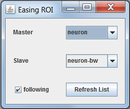
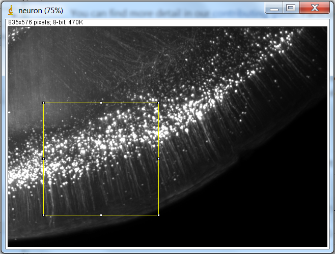
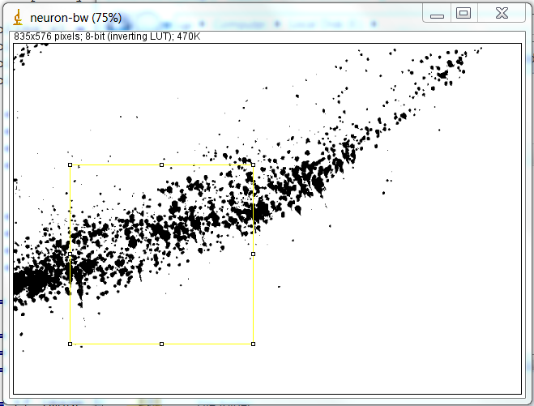

Easing_Roi
==========

An ImageJ plugin that make the same ROI selection in two images.

Usage
-----
put the "Easing_Roi.jar" under /bin/com/thinkpc/easingroi in the Plugin folder of the ImageJ path.

Open it in Plugin -> Easing ROI 

Preview
-------

The control panel :

Select a ROI region in the MASTER image and a ROI with identical parameters(anchor, width, height ...) will automatically show up in the SLAVE image.

